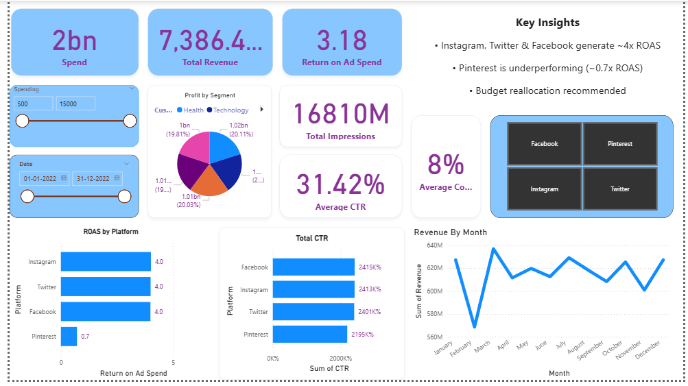

# Social-Media-Marketing-Dashboard
# Project Overview

Marketing teams often distribute budgets across platforms without a clear understanding of which channels truly generate profitable returns.

This project was built with one objective:

Turn raw campaign data into clear, data-backed budget decisions.

Instead of just visualizing metrics, I focused on answering a core business question:
Are we investing in the right platforms to maximize return on ad spend?

# The Problem
The dataset contained multi-platform campaign data including revenue, spend, clicks, impressions, and engagement metrics.

However:

- There was no unified view of performance.

- Platform efficiency was unclear.

- Budget allocation was not aligned with profitability.

- No structured comparison existed across channels.

- Trend analysis was missing.

# My Approach

I structured the dashboard in three analytical layers:

1️⃣ Executive Snapshot

Designed KPI cards to provide a quick performance overview:

- Total Revenue

- Total Spend

- Return on Ad Spend (ROAS)

- Total Impressions

- Click Through Rate (CTR)

- Conversion Rate

This allows decision-makers to instantly assess profitability and efficiency.

2️⃣ Platform-Level Performance Comparison

To identify performance gaps, I analyzed:

- ROAS by Platform

- CTR by Platform

- Revenue distribution by segment

This revealed which platforms were scaling efficiently and which were consuming budget without proportional returns.

3️⃣ Time-Based Trend Analysis

A monthly revenue trend was implemented to:

- Detect seasonality

- Identify growth patterns

- Monitor campaign consistency

Understand performance fluctuations over time

4️⃣ Interactive Exploration

Slicers were added for:

- Date range

- Spending range

- Platform selection

This enables dynamic filtering and scenario-based analysis.

# Key Insights

From the analysis, several patterns became clear:

- Instagram, Facebook, and Twitter consistently generated ~4x ROAS.

- Pinterest significantly underperformed (~0.7x ROAS).

- CTR varied meaningfully across platforms, influencing conversion efficiency.

- Revenue trends showed fluctuations month-over-month, suggesting campaign timing impact.

Not all platforms delivered proportional returns relative to their spend.

# Strategic Recommendation

Based on the data:  <mark>Reallocate budget from underperforming platforms (Pinterest) to high-efficiency platforms (Instagram & Facebook) to maximize overall marketing ROI.</mark>

This decision would:

- Increase capital efficiency

- Reduce wasted ad spend

- Improve overall profitability

- Optimize future campaign strategy

# Technical Implementation
Data Modeling

- Cleaned and structured campaign data for analytical use.

- Ensured proper data types and aggregation logic.

- Designed measures for scalable and reusable calculations.

Key DAX Measures
```dax Total Revenue = SUM('Campaign_Data'[Revenue])

Total Spend = SUM('Campaign_Data'[Acquisition_Cost])

ROAS = DIVIDE([Total Revenue], [Total Spend], 0)

Total Clicks = SUM('Campaign_Data'[Clicks])

Total Impressions = SUM('Campaign_Data'[Impressions])

CTR = DIVIDE([Total Clicks], [Total Impressions], 0)
```
Weighted metrics were used instead of simple averages to ensure analytical accuracy.

🛠 Tools Used

- Power BI

- DAX

- Excel (Data Cleaning & Preparation)


📷 Dashboard Preview

